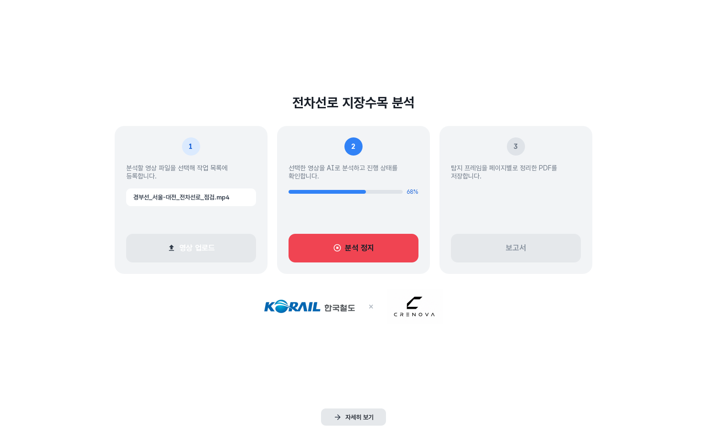
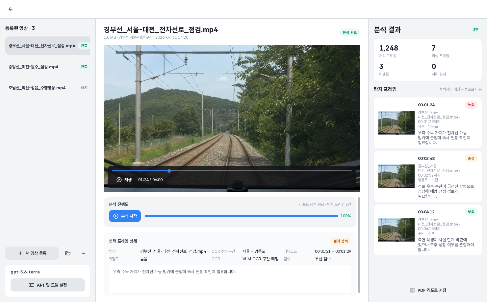

# 코레일 지장수목 분석 프로그램

철도 주행 영상을 AI로 분석해 전차선로 주변의 지장수목을 탐지하고, 검토 가능한 프레임과 PDF 보고서로 정리하는 데스크톱 프로그램입니다.

## 납품 범위

Windows·macOS용 데스크톱 앱과 AI 영상 분석 파이프라인, PDF 보고서, 설치 패키지와 릴리즈 자동화를 구축했습니다. UX/UI 설계부터 개발, 테스트와 배포까지 담당했습니다.

## 핵심 기능

영상 파일·폴더 드래그앤드롭, 등록 영상 선택과 재생, 분석 시작·정지, 진행률 표시, 로컬 Ollama Vision 위험도 판정, VLM 역명 OCR, 운행 구간 매핑, 탐지 프레임 검수, 통계 확인, 구간별 고유 프레임을 정리한 현장 양식형 PDF 저장과 인앱 미리보기 기능을 구현했습니다.

## 유저 플로우

사용자는 첫 화면에서 분석할 영상을 업로드하고, 선택된 파일명과 진행률을 확인하며 분석을 시작하거나 정지합니다. 자세히 보기를 누르면 영상 목록과 플레이어, 분석 상태, 통계, 탐지 프레임이 배치된 상세 화면으로 이동합니다. 탐지 프레임을 선택하면 해당 시점과 OCR 추정 구간, 위험도, 판단 근거를 검토할 수 있으며, PDF 저장 직후 앱 내부 미리보기로 최종 보고서를 확인합니다.

## 아키텍처

PySide6 기반 GUI와 FFmpeg 프레임 샘플링, Ollama Vision 판정, 모델별 프롬프트 하네스, VLM OCR, 구간 매핑, 이벤트 병합, PDF 생성 모듈을 분리했습니다. 분석 결과와 UI 상태는 영상 단위로 연결하며, 연속 탐지 프레임은 시간 간격을 기준으로 하나의 이벤트로 통합합니다. 보고서에는 Pretendard GOV 글꼴과 Unicode 정규화를 적용하고, PyInstaller와 GitHub Actions로 Windows·macOS 설치본을 생성합니다.

## 앱 화면

